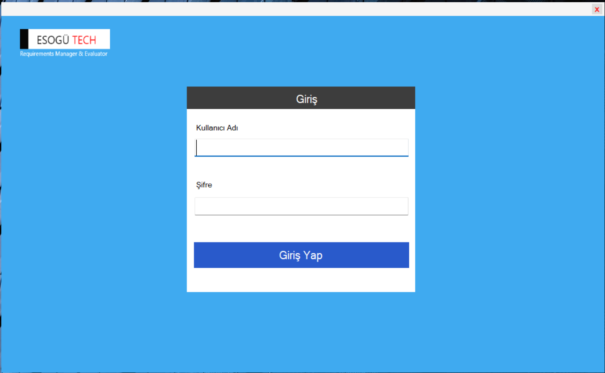
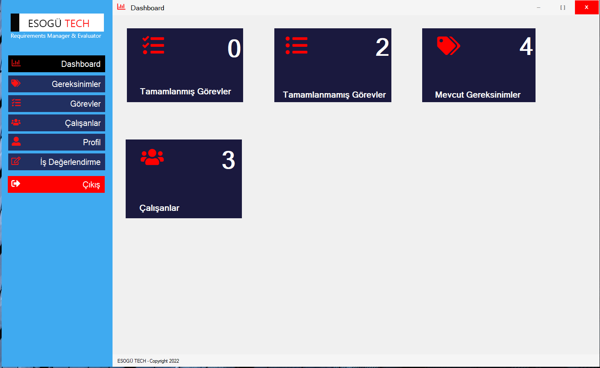
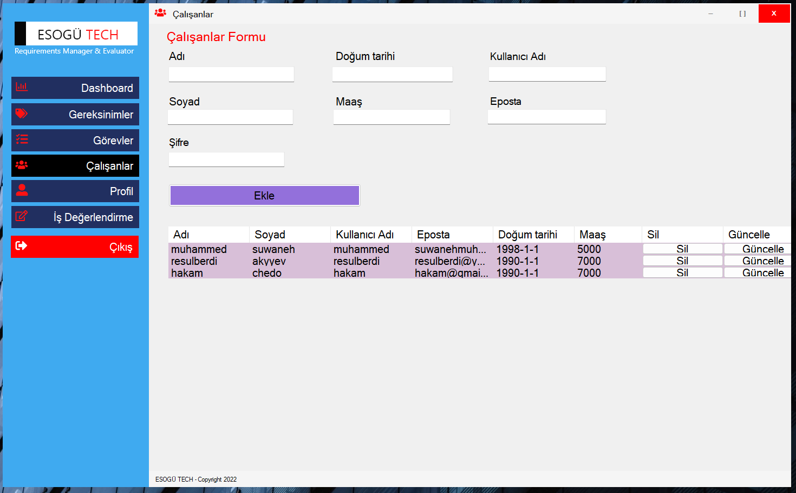
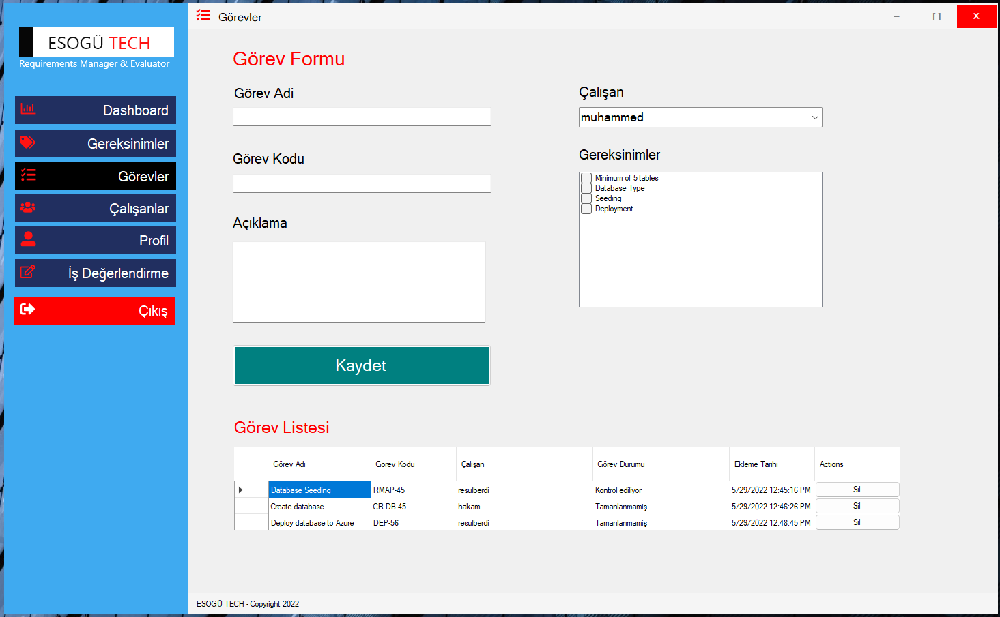
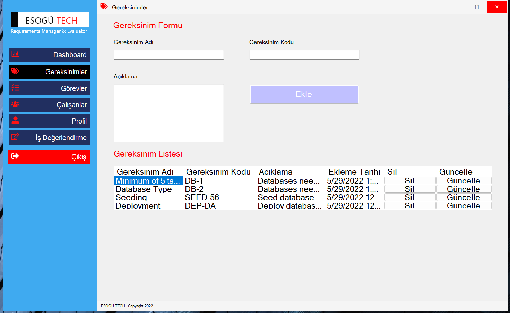
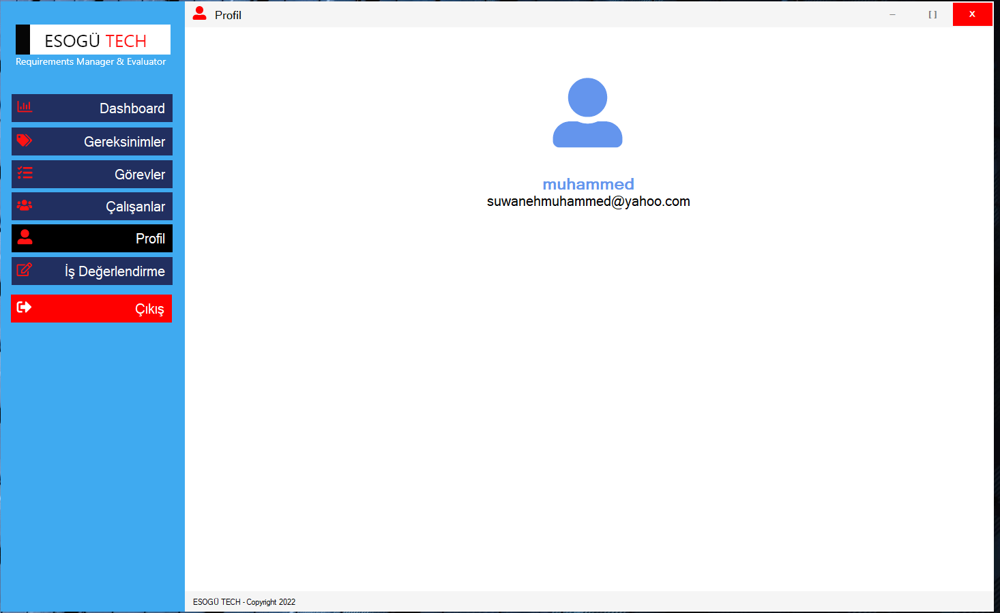
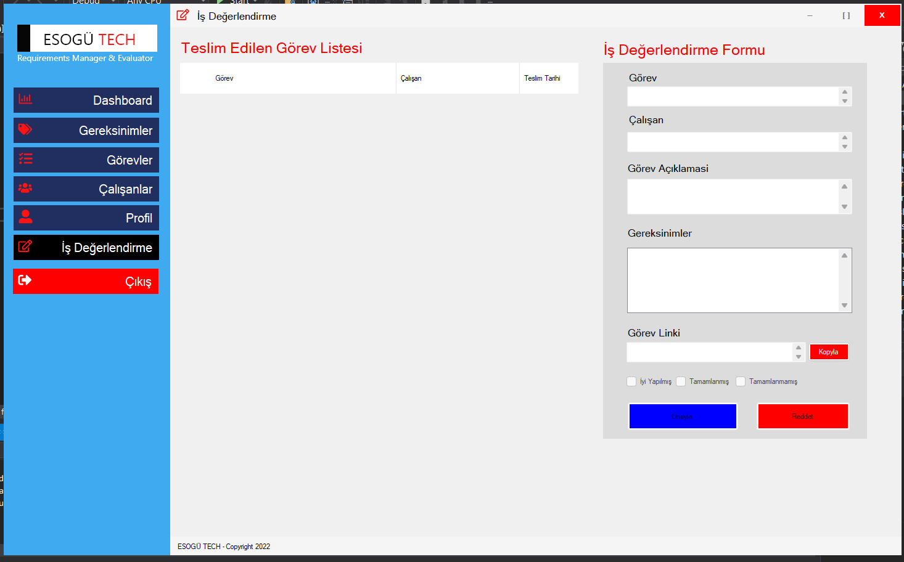

## Requirements Management & Work Evaluation Desktop Application

## About Project

A desktop application which allows workers to be assigned tasks. Given task can also be monitored and evaluated 
using DFA automata concepts. [learn more about automata](https://www.sciencedirect.com/topics/computer-science/formal-language)

## Prerequisites

You can run the application using the [ReqApp.exe](ReqApp/bin/Debug/) file. To run the source code, Visual studio with C#, .Net and
Windows Forms needs to be installed. The fontawesome library needs not be installed since the static files are already available. However
can be updated (from the Nuget Package Manager) to a new version if any update(s) is/are available

## Technologies utilised

  
  
  
  
  

## UI Screenshots

### Login 

For user authentication

### Dashboard

Grid view reprentation of application data

### Workers 

Displays all workers. New workers can be added, deleted and their info updated

### Tasks

Displays all tasks. Can be used to assigned task to any worker

### Requirements 

Displays all requirements and can be used to add new requirements.

### User Profile

Shows user info

### Work Evaluation

This page is used to evaluate submitted task using a simple DFA model

### My Tasks

Users can see task assigned to them from this page. They can as well submit(with a link) their task if completed. 

## Contributors

1. [Enes Ay](https://github.com/nsi-cyber) 
2. [Resulberdi Akyyev](https://github.com/Reak42)
3. [Muhammed Suwaneh](https://github.com/Muhammedsuwaneh)
4. [Yavuz Uçarkuş](https://github.com/yavuzucrkss)
5. [Hakam Chedo](https://github.com/H4K4M)

## Project Supervisor

Mr. Ahmet Yazıcı - Professor, Computer Engineering Department, Eskişehir Osmagazi University

## License 

This project is license under [`MIT`](LICENSE)

## Version 
1.0.0
